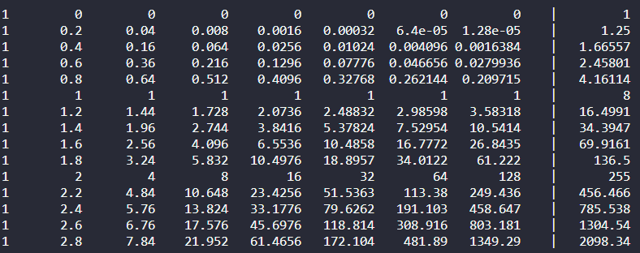
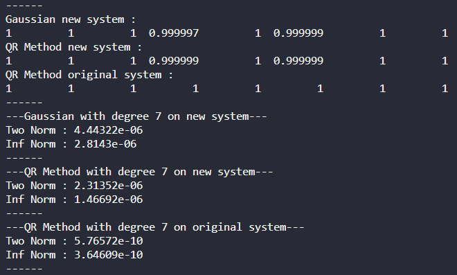
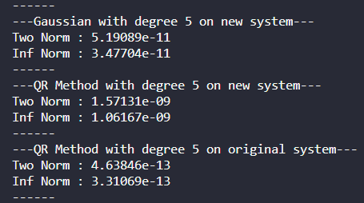
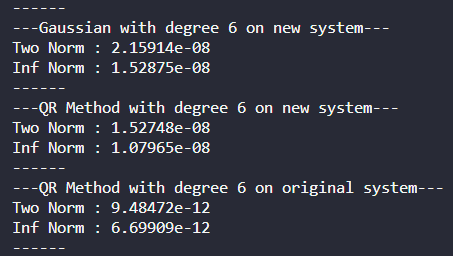
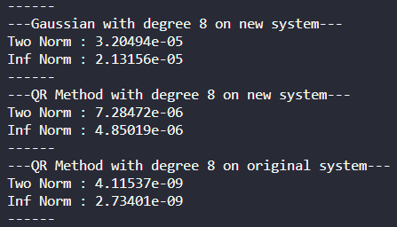
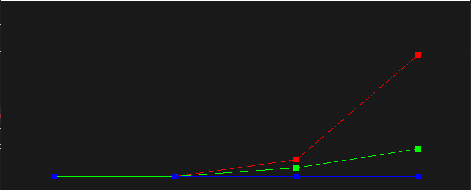
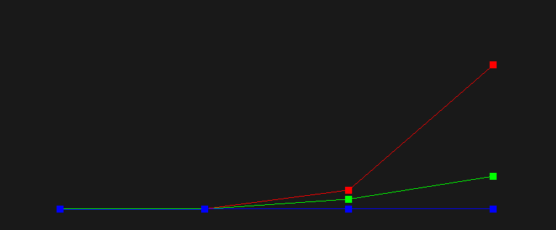
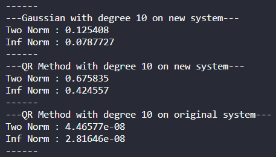
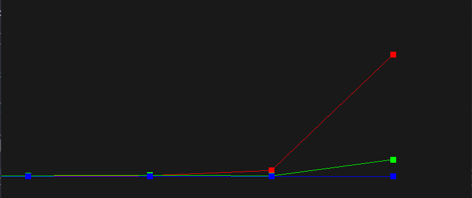

# Homework 4  
00957016 高敬庭  
## Requirement a  
+ degree 7 -- original system  
    
## Requirement b and c  

## Requirement d  
> 在我的結果中，我觀察到只要degree減少，相同方法的誤差值就會減少，相反的，只要degree提升，誤差就會增加，其中新系統的誤差永遠會比原始系統的誤差大。  

  
  
  
根據圖中的數據繪製出的Two Norm關係圖  

根據圖中的數據繪製出的Infinite Norm關係圖  
  
+ Red : Gaussian new system
+ Green : QR Method new system
+ Blue : QR Method original system  
> 關係圖的x軸代表degree，y軸代表誤差，將誤差normalize到[0,1]，可以看到三種作法在degree低的時候誤差不明顯，但是當degree增加的時候Gaussian的誤差會比QR Method來的大，而且新系統算出來的誤差會比原始系統的來的大。  
## Requirement e  
+ QR Method > Gaussian  
+ Original System > new System  
為了測試穩定性，將多項式的degree提升後做測試，由於計算過程中會產生計算誤差，所以可以知道degree提升帶來的誤差也會提升，以degree為10舉例，可以看到新系統由於又經過一次數值計算，所以誤差會比舊系統來的大，其中雖然QR Method在degree < 8 的情況下會比Gaussian來的準，但是只要超過7之後QR的誤差反而比Gaussian來的大，我認為應該是因為系統不準確所以導致結果更不准，如果將degree再進一步提升到15，則發現Gaussian的誤差增長又超越了QR，從圖中可以看出來Gaussian的誤差增長速度明顯快過於其他兩種情況，所以我認為QR還是相較於Gaussian穩定，而原始系統下的QR則非常穩定，即便系統誤差提高，其結果影響也沒有太大。    
  
